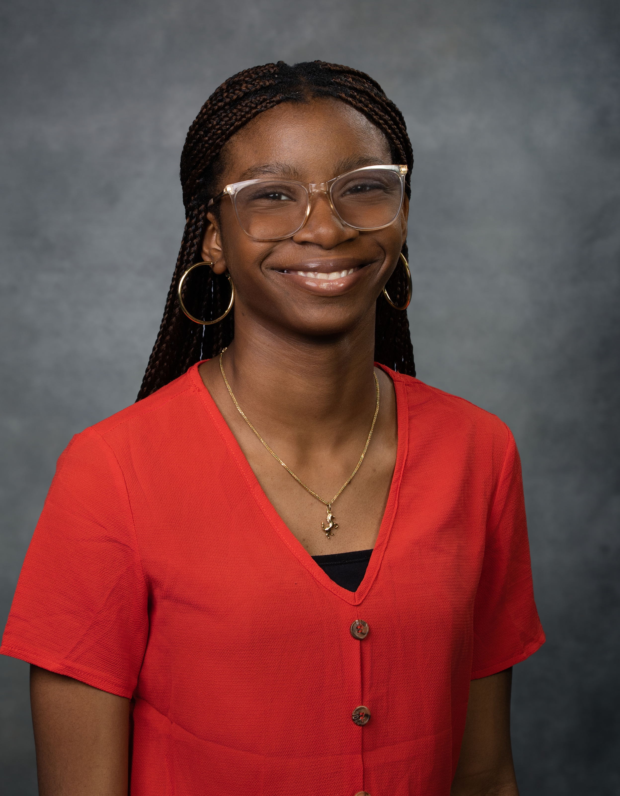

  

# Hi, I'm Chiamanda 👋
**🎓Sophomore at McNeese State University, studying Electrical Engineering with a minor in Computer Science.  
🤖Aspiring Robotics engineer  
Let's connect: [LinkedIn](https://www.linkedin.com/in/chiamanda-ononiwu/)  
Gmail: karenononiwu15@gmail.com**

I'm really interested in machine learning, circuit design, and control systems. I love problem-solving and building new skills. Currently, I'm a BreakThrough Tech fellow learning machine learning.  

## 🖥️Tech Stack
-  Language: Python 
-  Data Science: NumPy , Scikit-learn , Matplotlib , Seaborn 
-  Web Dev: HTML , CSS  ,
-  Tools: Jupyter Notebooks , Google Colab  , Arduino IDE 
-  Databases: SQLite  
  ## Projects
  
- Do Not Be Afraid Website ([Website Walkthrough Video](https://www.youtube.com/watch?v=xSBerlIhpBc)):
  It is a faith-based website that delivers daily Bible verses to encourage users. Built with SQLite, Python, HTML, CSS, and JavaScript, it features user logins, daily verse tracking, and a personalized page for saved verses.
- Smart Waste Bin Optimization ([Project README](https://github.com/Chiamanda07/C.L.E.A.R-Smart-City-Project)): This project showcases the development of a Smart Waste Monitoring System using IoT sensors, AI-driven analytics, and real-time cloud connectivity to track bin fill levels, environmental conditions, and classify waste.

## What I'm Learning
- Deepening my knowledge and practical skills in machine learning, including data preprocessing, model training, and evaluation.
- Gaining hands-on experience with Verilog HDL programming for designing and simulating digital circuits.

Don't hesitate to reach me 😜 :  

## GitHub Stats  
  

<!---
Chiamanda07/Chiamanda07 is a ✨ special ✨ repository because its `README.md` (this file) appears on your GitHub profile.
You can click the Preview link to take a look at your changes.
--->
